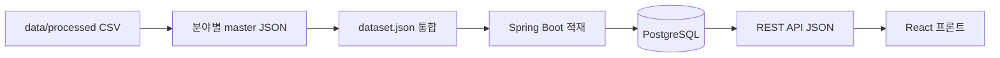

# LOCAL:ON

공공 관광 데이터를 바탕으로 관광 집중 지역과 로컬 생활권을 연결하는 여행 코스 추천 애플리케이션입니다.

## 프로젝트 구조

```text
visitkorea/
├── frontend/                 React + Vite + Nginx
├── backend/                  Spring Boot + PostgreSQL
├── data/processed/           데이터팀 CSV 및 master JSON
│   ├── attraction/
│   ├── market/
│   └── restaurant/
├── scripts/build_all.py      로컬 실행용 진입점
├── scripts/build_dataset.py  master JSON 생성 및 dataset 통합
└── docker-compose.yml
```

## 전체 실행

저장소 루트에서 다음 명령을 실행합니다.

```bash
docker compose up --build
```

첫 실행에서는 `data-builder`가 데이터팀 CSV로 분야별 master JSON을 만들고 이를 `dataset.json`으로 통합합니다. 이후 백엔드가 PostgreSQL에 3만여 건을 적재한 후 프론트가 시작됩니다.

- 애플리케이션: http://localhost:4173
- 백엔드 직접 확인: http://localhost:8080/actuator/health
- PostgreSQL: `localhost:25433` (`localon` / `localon`)

실행 상태와 로그 확인:

```bash
docker compose ps
docker compose logs -f data-builder backend
```

종료:

```bash
docker compose down
```

데이터베이스까지 완전히 초기화해야 할 때만 아래 명령을 사용합니다. 가입 계정과 저장 목록도 삭제됩니다.

```bash
docker compose down -v
```

## 데이터 처리 흐름

Compose 실행 시 다음 작업이 자동으로 이루어집니다.

1. `data/processed`의 관광지·전통시장·음식점 CSV를 읽습니다.
2. 장소, 상세, 점수 파일을 ID로 결합합니다.
3. `attraction_master.json`, `market_master.json`, `restaurant_master.json`, `region_metrics.json`을 생성합니다.
4. 네 개의 master JSON을 Docker volume의 `dataset.json` 하나로 통합합니다.
5. 백엔드가 `dataset.json`을 PostgreSQL에 upsert합니다.
6. 프론트는 원본 CSV나 master JSON에 접근하지 않고 백엔드 API JSON만 사용합니다.



세부 흐름과 파일별 책임은 `docs/DATA_PIPELINE.md`에 정리되어 있습니다.

현재 변환 대상은 관광지 15,710건, 전통시장 1,393건, 음식점 16,949건으로 총 34,052건입니다. 전통시장은 점수 원본이 없으므로 점수를 `null`로 유지하며, 데이터팀이 점수를 추가하면 변환 스크립트에 해당 컬럼을 연결하면 됩니다. 원본 CSV는 수정하지 않습니다.

통합 데이터만 따로 생성해 확인하려면:

```bash
python3 scripts/build_all.py \
  --data-root data/processed \
  --region-resources backend/src/main/resources \
  --masters-root data/processed \
  --output /tmp/localon-dataset.json
```

## API 연결 방식

Docker 프론트는 브라우저에서 `http://localhost:8080`을 직접 호출하지 않습니다. `/api` 요청을 같은 출처인 `http://localhost:4173/api`로 보내고, Nginx가 Docker 내부의 `backend:8080`으로 전달합니다. 따라서 브라우저의 `ERR_CONNECTION_REFUSED`와 CORS 문제를 줄일 수 있습니다.

주요 API:

```text
POST /api/auth/signup
POST /api/auth/login
GET  /api/auth/me
PUT  /api/auth/me
GET  /api/regions
GET  /api/regions/{regionId}/places
GET  /api/places/{placeId}
GET  /api/search?q={query}
POST /api/recommendations
GET  /api/favorites
GET  /api/courses
```

## 로컬 개발 모드

PostgreSQL만 Docker로 실행:

```bash
docker compose up -d postgres
```

백엔드 실행:

```bash
cd backend
DB_URL=jdbc:postgresql://localhost:25433/localon ./gradlew bootRun
```

프론트 실행(다른 터미널):

```bash
cd frontend
npm ci
npm run dev
```

Vite 개발 서버도 `/api` 요청을 `localhost:8080`의 백엔드로 전달합니다. 환경변수 예시는 `frontend/.env.example`, `backend/.env.example`에서 확인할 수 있습니다.
