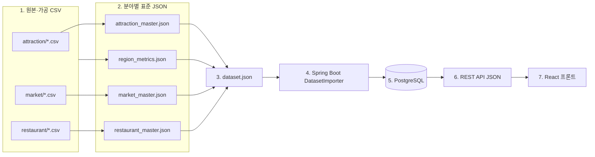

# LOCAL:ON 데이터 파이프라인

## 처리 흐름



## 단계별 책임

| 단계 | 입력 | 출력 | 책임 |
|---|---|---|---|
| CSV 정리 | 공공데이터 CSV | 분야별 정제 CSV | 데이터팀 |
| Master 생성 | 정제 CSV | 분야별 master JSON | 데이터 빌더 |
| Dataset 통합 | master JSON 4개 | `dataset.json` | 데이터 빌더 |
| DB 적재 | `dataset.json` | PostgreSQL 테이블 | 백엔드 |
| 화면 표시 | REST API JSON | 지도·장소·코스 화면 | 프론트엔드 |

프론트엔드는 CSV와 master JSON을 직접 import하지 않습니다. 모든 장소·지역·점수 정보는 `/api` 응답을 통해서만 받습니다.

## 생성 명령

```bash
python3 scripts/build_all.py \
  --data-root data/processed \
  --region-resources backend/src/main/resources \
  --masters-root data/processed \
  --output /tmp/localon-dataset.json
```

Docker Compose에서는 동일한 파이프라인 함수가 들어 있는 `scripts/build_dataset.py`를 `data-builder` 서비스에서 직접 실행합니다. master JSON의 데이터 버전이 서로 다르거나 분야 간 장소 ID가 중복되면 통합을 중단합니다.
